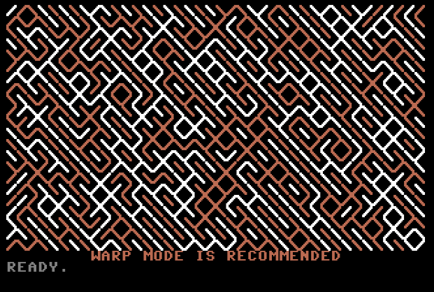

# C64 BASIC - pattern tracing

Generating a random pattern of diagonal lines, and then coloring the lines that are connected, using alternating colors.

The program listing is below. To run it, simply copy/paste it into vice64. Or start the prg file. Warp mode is recommended, as the algorithm is tremendously ineffective! It was just an idea that popped into my head the other day. :-)

August 23 2020




## Useful commands

convert <foo.txt> to <foo.prg>
```
$ petcat -w2 -o foo.prg foo.txt
```


start vice with prg file loaded
```
$ x64 foo.prg
```

start vice with warp mode enabled and prg file loaded
```
$ x64 -warp foo.prg
```


## Program listing

To run this in vice64, copy/paste the code below. The rem statements don't end up as a part of the code listing

```
rem set screen colors, default text color, clear screen, move crsr down

10 poke53280,0: poke53281,0


rem set default text color and clear screen

11 print chr$(151): print chr$(147);


rem define the size of the board and the alternating color codes

12 let dx=40: let dy=22
13 let ca=1: let cb=2


rem put crsr below the generated pattern

14 for y=0 to dy-1: print: next y
15 print chr$(28);
16 print"        warp mode is recommended";
17 print chr$(151);


rem generate random structure with a 1/3 chance of backslash

100 for y=0 to dy-1
105 for x=0 to dx-1
110 let n=int(rnd(1)*3)
115 if n=0 then 125
120 n=77:goto 130
125 n=78:goto 130
130 poke 1024+y*40+x,n
135 next x
140 next y


rem set start color on the top left character

200 let co=ca
205 poke 55296,co


rem loop through each character in the pattern.
rem if a character has the current color
rem then gosub to examine the surrounding characters.
rem the pattern is scanned topleft to bottomright first
rem and then backwards, to increase performance somewhat.
rem variable ok is 0 if no changes have been made during the scan
rem which means there is nothing more to do for that particular pattern.

300 let ok = 0
304 for y=0 to dy-1
305 for x=0 to dx-1
310 if (peek(55296+y*40+x) and 15) = co then gosub 400
335 next x
340 next y
345 if ok > 0 then goto 351
350 goto 360: rem end

351 let ok = 0
352 for y=dy-1 to 0 step -1
353 for x=dx-1 to 0 step -1
354 if (peek(55296+y*40+x) and 15) = co then gosub 400
355 next x
356 next y
357 if ok > 0 then goto 300
358 goto 360: rem end


rem current path is complete. find the next free color (11)
rem and goto 800 to determine what color is the next one.
rem if no free color is found, the entire pattern has been scanned.

360 for y=0 to dy-1
364 for x=0 to dx-1
366 if (peek(55296+y*40+x) and 15) = 11 then goto 800
367 co = (peek(55296+y*40+x) and 15)
368 next x
370 next y
372 end


rem sub routine for checking neighbor characters.
rem the current character dictates what to look for, and where
rem ch = character under cursor
rem cm = character to match
rem cx = x coordinate to check
rem cy = y coordinate to check
rem 77 = backslash 78 = slash
rem when this is set up a general sub is called (700)

400 let ch=peek(1024+y*40+x)
410 if ch = 77 then goto 500
420 if ch = 78 then goto 600
430 return

rem look for matches to backslash

500 let cm = 77
510 let cx=x-1: let cy=y-1: gosub 700
520 let cx=x+1: let cy=y+1: gosub 700
530 let cm = 78
540 let cx=x  : let cy=y-1: gosub 700
550 let cx=x-1: let cy=y  : gosub 700
560 let cx=x+1: let cy=y  : gosub 700
570 let cx=x  : let cy=y+1: gosub 700
580 goto 430

rem look for matches to slash

600 let cm = 78
610 let cx=x+1: let cy=y-1: gosub 700
620 let cx=x-1: let cy=y+1: gosub 700
630 let cm = 77
640 let cx=x  : let cy=y-1: gosub 700
650 let cx=x-1: let cy=y  : gosub 700
660 let cx=x+1: let cy=y  : gosub 700
670 let cx=x  : let cy=y+1: gosub 700
680 goto 430


rem sub routine for changing color on a pos if it meets the requirements.
rem if desired coordinates are out of bounds then return.
rem if the color is already set then return (nothing to do).
rem change color if cm equals ch
rem flag ok

700 if cx < 0 then return
710 if cx >= dx then return
720 if cy < 0 then return
730 if cy >= dy then return
740 if (peek(55296+cy*40+cx) and 15) <> 11 then return
750 if peek(1024+cy*40+cx) <> cm then return
760 poke 55296+cy*40+cx,co
770 ok = ok + 1
780 return


rem determine the new color, which is the opposite of the last one.
rem if start of line, then the last color is above the character.
rem assign new color to position and goto 300 to restart scanning.

800 if x<>0 then goto 810
801 co = (peek(55296+(y-1)*40+x) and 15)
810 if co = ca then goto 812
811 co = ca: goto 820
812 co = cb
820 poke 55296+(y*40)+x,co
825 goto 300

``` 
